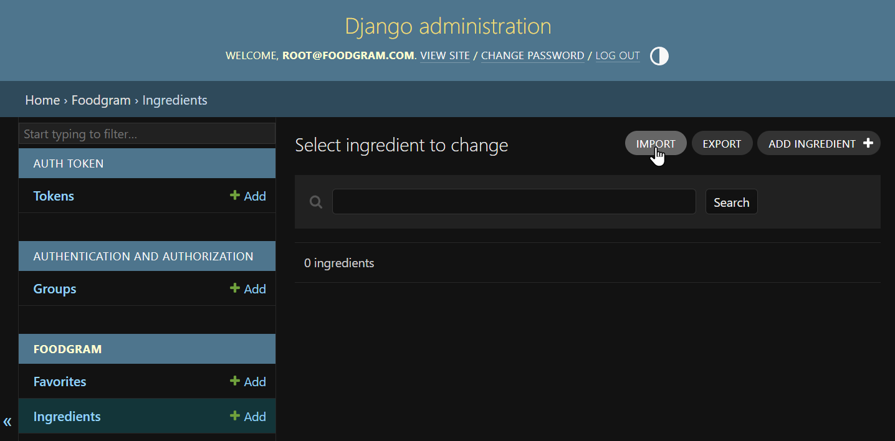
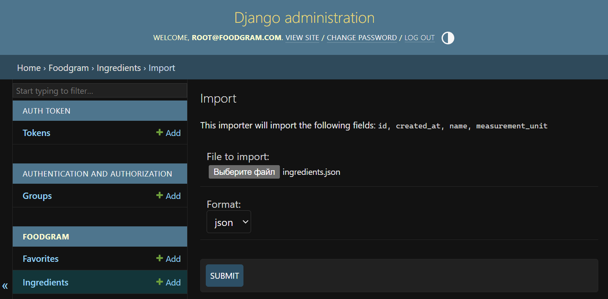

# foodgram-st

https://hub.docker.com/r/eugritz/foodgram-backend

1. [Инструкция](#инструкция)
    1. [Запуск приложения](#запуск-приложения)
    2. [Импортирование ингредиентов](#импортирование-ингредиентов)
2. [Конфигурация foodgram-backend](#конфигурация-foodgram-backend)

## Инструкция

### Запуск приложения

Находясь в папке infra, выполните команду:

```
docker compose up
```

Приложение доступно по адресу http://localhost/.

Спецификация API доступна по адресу http://localhost/api/docs/.

Панель администратора доступна по адресу http://localhost/admin/.

### Импортирование ингредиентов

Импортирование ингредиентов возможно с помощью модуля django-import-export,
например через панель администратора.

1. Создайте супер-пользователя, если он ещё не создан:

```sh
# В папке backend
python manage.py createsuperuser
# ИЛИ если вы используете Docker
docker exec -ti foodgram-backend python manage.py createsuperuser
```

2. Откройте панель администратора http://127.0.0.1:8000/admin/ (или http://localhost/admin/) и войдите в пользователя.

3. Выберите таблицу Ingredients и кнопку "IMPORT".



4. Выберите один из файлов из папки **backend/data/**



5. Нажмите кнопку "CONFIRM", далее "CONFIRM IMPORT".

## Конфигурация foodgram-backend

Возможна настройка foodgram-backend через переменные среды, например:

```sh
FOODGRAM_TEST=1 docker compose up
```

|Переменная       |Значение |Описание                         |
|-----------------|---------|---------------------------------|
|`FOODGRAM_DEBUG` |`0`, `1` |Режим отладки<sup>[1]</sup>      |
|`FOODGRAM_TEST`  |`0`, `1` |Режим тестирования<sup>[2]</sup> |

<sup>[1]</sup> переключает СУБД на SQLite и переменную `DEBUG` в Django.

<sup>[2]</sup> для автоматического тестирования; загружает фикстуры в виде
дополнительных миграций (например ингредиенты).
